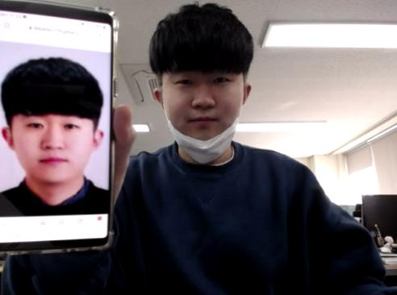
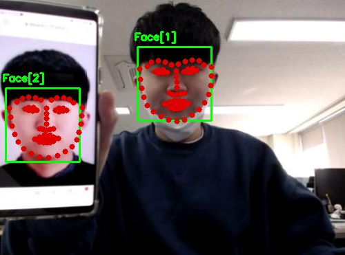

  

     
  

## face_recognition
* #### 파이썬 얼굴 인식 라이브러리

---
### 실행 환경
* #### Ubuntu
* #### OpenCV Version : 3.x.x
  * ##### 설치 : https://blog.naver.com/dldudcks1779/222020005648
* #### imutils
  * ##### 설치 : sudo pip3 install imutils
* #### face_recognition
  * ##### 설치 : sudo pip3 install face_recognition
  
---
## 이미지 얼굴 랜드마크 인식
* #### 이미지를 저장하지 않을 경우
  * sudo python3 face_recognition_landmarks_image.py --input 이미지 경로
    * 예) sudo python3 face_recognition_landmarks_image.py --input ./face_image.jpg
* #### 이미지를 저장할 경우
  * sudo python3 face_recognition_landmarks_image.py --input 이미지 경로 --output 저장할 이미지 경로
    * 예) sudo python3 face_recognition_landmarks_image.py --input ./face_image.jpg --output ./result_face_landmarks_image.jpg

  

     
    
  

---
## 비디오 얼굴 랜드마크 인식 - 웹캠 또는 동영상(webcam or video)
* #### 비디오를 저장하지 않을 경우
  * webcam : sudo python3 face_recognition_landmarks_video.py
    * 예) sudo python3 face_recognition_landmarks_video.py
  * video : sudo python3 face_recognition_landmarks_video.py --input 비디오 경로
    * 예) sudo python3 face_recognition_landmarks_video.py --input ./face_video.avi
* #### 비디오를 저장할 경우
  * webcam : sudo python3 face_recognition_landmarks_video.py --output 저장할 비디오 경로
    * 예) sudo python3 face_recognition_landmarks_video.py --output ./result_face_landmarks_video.avi
  * video : sudo python3 face_recognition_landmarks_video.py --input 비디오 경로 --output 저장할 비디오 경로
    * 예) sudo python3 face_recognition_landmarks_video.py --input ./face_video.avi --output ./result_face_landmarks_video.avi

---
